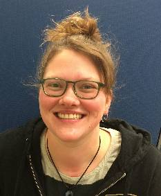
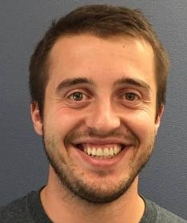

# Current RMDS Team Members

__Jordan Love__ \\
__Co-founder__, _2018 - 2019, 2020 - Present_

Jordan Love is a Graduate Student currently pursuing a Ph.D in Statistics. He previously completed a Masters in Statistics at Montana State University and has worked at a Data Scientist in eCommerce and Marketing. Jordan’s research interests include Bayesian Statistics, Dynamic Linear Models, and Bayesian Computation.  

Website: [NotUnlikely.com](https://NotUnlikely.com) \\
Github: [jljsio](https://github.com/jljsio) \\
Twitter: [@jljsio](https://twitter.com/jljsio) 
\\
\\
__Catherine Potts__ \\
__Co-founder__, _2018 - Present_

Catherine Potts is a Mathematics Ph.D. student whose research interests include data science, machine learning, computer vision, geometric data analysis, and imaging problems. Past experience includes software engineering and teaching intro to programming via C++ and Python.

\\
\\
__Jordan Schupbach__ \\
_2019 - Present_

Jordan Schupbach is a Ph.D. student in statistics at MSU. His research  interests include functional and shape data analysis, machine learning,  optimal design, nonparametric statistics and topological data analysis.  He has teaching experience in introductory statistics courses and has taught workshops for computing in Python and R.  

\\
\\
__Joe Bretz__ \\
_2020 - Present_

Joe Bretz is a Ph.D. candidate in physics at MSU studying astrophysics. Joe's research encompasses modeling neutron stars and applying machine learning to astronomy data. His interests include expanding the use of machine learning techniques to accelerate data-driven science.

\\
\\
__Dominique Zosso__ \\
__Faculty Advisor__, _2018 - Present_

Dr. Dominique Zosso is Assistant Professor of Mathematics at MSU. He combines a background (M.Sc. 2006, Ph.D. 2011) in Electrical Engineering with research and teaching experience as visiting professor in Mathematics at UCLA (2012-2016). His research interests are PDE and variational models for inverse problems in signals, images, and data science.

## Previous RMDS Team Members

__Tristan Anacker__\\
__Co-founder__, _2018 - 2019_

Tristan Anacker is a Statistics Master’s student with interests in high dimension data problems, including visualization, dimension reduction, and applications in metabolomics. Future goals include implementation of statistical methods and other data science skills in an industrial setting.

\\
\\
__Kehinde (Kenny) Ajayi__ \\
_2019 - 2020_

Kehinde (Kenny) Ajayi is a Masters student in  Statistics. His research focuses on text mining and Natural Language  Processing. Kenny’s data science interests include Machine learning,  Natural Language Processing and Deep Learning

\\
\\
__Kai Jenson__ \\
_2019 - 2020_

Kai Jensen is a Non-Tenure Track professor in the mathematics department. He earned a M.S. in Mathematics at Montana State in 2018. His past experience include teaching Mathematics courses ranging from High School Algebra to Multivariable Calculus. His research interests include optimization, machine learning, and neural networks.

\\
__Mykhaylo (Mike) Shumko__ \\
_2019 - 2020_

Mykhaylo (Mike) Shumko is a recent physics Ph.D. graduate from MSU. His  research in space physics focuses on time series analysis and modeling  of energetic particle precipitation from the The Van Allen radiation  belts into Earth's atmosphere. Mike also commands and operates MSU's twin FIREBIRD-II CubeSats in low Earth orbit. Mike's  data science interests include: Bayesian inference, dimensionality  reduction, neural networks and data visualization.